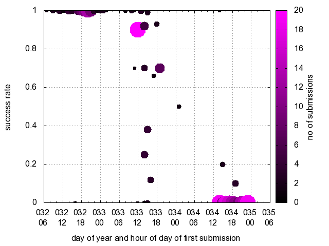

# Graf
## Zadání
Statistiky o úspěšnosti studentů v programátorských úlohách jsou potřebné pro sledování kvality studijních materiálů a zadání úloh napříč akademickými roky. Důležitou věcí jsou grafy ukazující vztah času prvního odevzdání úlohy a úspěšnosti (hodnocení) finálního řešení. Vaším úkolem je implementovat generátor takových grafů tak, aby bylo možné je kterýkoli akademický rok znovu vygenerovat. Požadavkem je využít program Gnuplot. Vytvořte skript (obyčejný textový soubor obsahující posloupnost příkazů) programu Gnuplot pro vygenerování grafu z předložených dat tak, aby byly splněny všechny níže uvedené požadavky.

## Specifikace
### Vstupní data

Úkolem je zpracovat konkrétně vzorová data, která si z této stránky můžete stáhnout (je nutné je nejprve extrahovat z archivu). Vaše řešení ale musí být funkční i pro jiná data. Pro účely otestování bude použito několik náhodně vygenerovaných datových sad, všechny splňující následující specifikaci.

Vstupem je textový soubor vždy pojmenovaný data.txt uložený v kódování UTF-8 s unixovými konci řádků. Jde o soubor formátu CSV (hodnoty oddělené středníkem). Je zaručeno, že soubor obsahuje alespoň jeden řádek, žádný řádek není prázdný a počet řádků není shora omezen. Každý řádek je unikátní a obsahuje všechny dále uvedené sloupce v uvedeném pořadí:

1. datum a hodina prvního odevzdání ve formátu _rok-měsíc-den hodina_
2. hodnocení jako desetinné číslo mezi 0 a 1 (včetně)
3. počet jako počet (přirozené číslo) studentských řešení se shodným finálním hodnocením, kdy první odevzdání proběhlo ve stejnou hodinu

### Výstup

#### Výsledný obrázek

Graf bude vygenerovaný na základě skriptu interpretovaného programem Gnuplot verze 4.6. Soubor se skriptem musí být pojmenovaný `gnuplot.gp`. Skript čte data ze souboru pojmenovaného `data.txt`. Jméno souboru nelze měnit.

Je nutné přesně dodržet všechny pokyny a požadavky. Jakákoli odlišnost, byť malá, může mít za následek odmítnutí odevzdaného řešení. Obrázek vygenerovaný odevzdaným skriptem musí být naprosto shodný s příkladovým při zpracování vzorových dat. Nenastavujte písmo, žádnou velikost, rozměr, zvětšení, posun, barvu ani rotaci, pokud nebude v pokynech uvedeno jinak. Vzorový obrázek byl vygenerován s tímto nastavením:

`set terminal png nocrop font "arial,12" fontscale 1.0 size 640,480`

Toto nastavení je pouze pro Váš náhled, hodnocení je na něm nezávislé. Vezměte tedy v potaz, že s odlišným nastavením výstupu (také v závislosti na Vaší instalaci) můžete získat odlišný obrázek. Takovéto případné odlišnosti (způsobené čistě tímto nastavením) jsou pro hodnocení nepodstatné, tedy pokud jste správně dodrželi všechny pokyny.

**Důležité:** stejně jako písmo a další implicitní vizuální atributy, nenastavujte ani terminal (formát výstupu), ani výstupní soubor (volání `set output`) – žádná z těchto nastavení nesmí být ve skriptu, který odevzdáváte na Progtest. Rovněž nepřistupujte k voláním shellu nebo spouštění externích programů. Uděláte-li cokoli z předchozího, způsobí to **neúspěch odevzdání** Vašeho skriptu na Progtest.

Graf ukazuje vztah finálního hodnocení (a počtu studentů ve stejné situaci) k času prvního odevzdání. Hodnoty na ose _x_ ukazují čas prvního odevzdání, hodnoty na ose _y_ pak finální hodnocení. Každý datový bod je zobrazen jako kruh (`circle`). Počet studentů (_počet_), kteří poprvé odevzdali ve stejnou hodinu a mají stejné hodnocení, je zohledněn v poloměru a barvě kruhu.

Osa _y_ má popisek _success rate_, který je spolu s popisky hodnot umístěn vlevo. Na ose jsou vždy zobrazené hodnoty mezi 0 a 1 (je nutné to zaručit nezávisle na vstupních datech). Osa x má popisek _day of year and hour of day of first submission_, který je spolu s popisky hodnot umístěn dole. Popisky hodnot závisí na vstupních datech (nenastavujte ani je ani rozsah zobrazených hodnot). Každý popisek hodnot sestává z dvou řádků: první obsahuje pořadové číslo dne v rámci roku (např. 1. únor odpovídá číslu 32), druhý pak hodinu prvního odevzdání (v rámci dne). Legenda barev (`colorbox`) ukazující rozsah barev pro počet je umístěna vpravo a označena _no of submissions_. Popisky hodnot (počtu) jsou umístěné vpravo a závisí na vstupních datech (nenastavujte ani je ani rozsah hodnot).

Poloměr každého kruhu závisí na hodnotě počet, jak je určeno v následující formuli s druhou odmocninou: √(_počet_⋅2^22) . Poloměr je vyjádřen v jednotkách hodnot na ose _x_.

Barva každého kruhu závisí na hodnotě _počet_. Je určena po složkách červená, zelená a modrá takto: neobsahuje zelenou, červená a modrá jsou stejné a jejich hodnota roste lineárně s hodnotou _počet_ a jejich hodnota je rovna 0 pro počet rovný 0 (přesně _počet=červená=modrá_). Nápověda: je potřeba nastavit barevnou paletu, především mapovací funkce pro `rgbformulae`. Indexy funkcí lze zjistit pomocí `show palette rgbformulae`.

### Odevzdání

Na Progtest odevzdejte skript pro Gnuplot pro vygenerování grafu pojmenovaný `gnuplot.gp` (obyčejný textový soubor, musí mít konce řádků v unixovém formátu). Skript načítá veškerá data výhradně ze souboru `data.txt`, neobsahuje volání `set terminal` ani `set output`.

#### Význam chybových hlášení

* Selhání testovacího subsystému
  * zásadní chyba odevzdání (chybně pojmenovaný soubor, použití zakázané funkcionality apod.)
* Nesprávné formátování výstupu
  * výsledek (obrázek) se liší od požadovaného
* Chyba je pouze v zobrazení výstupu programu
  * viz předchozí
* Nesprávný výstup
  * při běhu programu Gnuplot došlo k chybě (syntaktická chyba, pokus o čtení neexistujícího datového souboru apod.)

### Hodnocení

Bonus (tj. 50 % bodů navíc) lze získat při odevzdání do 2 týdnů od otevření úlohy. Pozdní odevzdání je penalizováno zpočátku ztrátou 30 % bodů, tato penalizace se však postupně zvyšuje s přibližujícím se koncem období pro pozdní odevzdání.

Pro vzorová data vypadá správný obrázek vygenerovaný programem Gnuplot:

### Řešení problémů

V případě problémů a dotazů prosím přispějte do **diskuse na EDUXu**, případně pošlete mail některému z vyučujících specializovaných na Gnuplot: _xxx_.

### Vzorová data
Vzorová vstupní data jsou uložena v souboru _data.txt_.