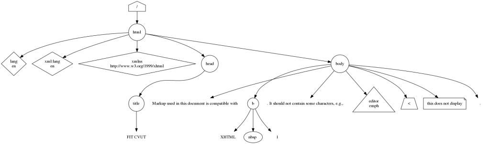

# Generování diagramu
## Zadání
Napište program v C++, který vygeneruje stromovou vizualizaci DOM nějakého XML dokumentu. Diagram vygenerujte ve formátu jazyka dot vizualizačního balíčku Graphviz.

## Specifikace
### Vstupní data

Veškerá vstupní data budou na standardním vstupu vašeho programu. Na něm bude textová reprezentace Document object model (DOM) nějakého XML dokumentu. Každý řádek vstupu reprezentuje jeden uzel DOM. Vstup odpovídá **specifikaci DOM Level 1 verze 1** s následujícími omezeními a zjednodušeními (tj. je zaručeno, že vstup nebude obsahovat nic, co není dovoleno specifikací):

* DOM obsahuje nejvýše 1 kořenový (nejvyšší) uzel a vždy jde o kořenový element XML dokumentu,
* každá řádka vstupu má následující formát: odsazení #typ-uzlu data
* odsazení
  * je vždy realizováno pomocí mezer a ukazuje hloubku zanoření v odpovídajícím stromě DOM (tj. ukazuje vztah rodič-potomek nebo vztah sourozenecký: dva po sobě uvedené uzly se stejným odsazením jsou na stejné úrovni zanoření; jestliže uzel b je uveden po uzlu a, kde odsazení _b_ je větší než odsazení _a_, _a_ je rodič _b_
* typ-uzlu
  * může být cokoli z následujícího (ukázáno s odpovídajícími **Core interfaces DOM**)
  * attribute
    * Attr
  * cdata-section
    * CDATASection
  * comment
    * Comment
  * element
    * Element
  * entity-reference
    * EntityReference
  * processing-instruction
    * ProcessingInstruction
  * text
    * Text
* data
  * ukazují další informace (např. vlastnosti) týkající se uzlu; vždy jsou od _#typ-uzlu_ oddělená jednou mezerou; struktura a formát závisí na _typ-uzlu_:
  * attribute
    * formát: _jméno=hodnota_
  * cdata-section
    * obsah sekce (žádné omezení nebo struktura)
  * comment
    * text komentáře (žádné omezení nebo struktura)
  * element
    * _tagName_
  * entity-reference
    * jméno odkazované entity
  * processing-instruction
    * formát (oddělovač je jedna mezera): target data
  * text
    * samotný text (žádné omezení nebo struktura)
  * Data mohou obsahovat libovolný znak (nezakázaný specifikací DOM). Pro zjednodušení vašeho programu je zaručeno, že data nemohou obsahovat znak nového řádku.

Příklad vstupu najdete pod vzorovými daty. Není nutné kontrolovat syntaxi (správnost) vstupu, ten je vždy v souladu s výše uvedenou specifikací. Je zaručeno, že vstup obsahuje alespoň jeden uzel DOM. Vstup může končit prázným řádkem.

### Výstup

Požadovaný výsledek se zapisuje na standardní výstup programu. Výstupem bude diagram v souladu s následujícími pokyny zapsaný v jazyce dot a určený pro zpracování rozmísťovacím algoritmem dot balíčku **Graphviz**. Diagram bude mít formu souvislého orientovaného grafu. V popiscích nepoužívejte HTML ani znak odřádkování (CR nebo LF, můžete místo toho použít `\n`).

Po zpracování rozmísťovacím algoritmem dot (Graphviz), by měl váš výstup být v souladu s níže uvedenými pokyny. Součástí pokynů je i vzorový obrázek (níže). Ten byste měli dostat, pokud vaším programem zpracujete vzorový vstup (ke stažení níže).

Každý uzel výsledného diagramu odpovídá jednomu uzlu vstupního DOM (tj. řádku vstupu). Uzly ve výstupu by se měly objevit ve stejném pořadí, v jakém jsou uvedeny na vstupu. Popisky všech uzlů jsou zarovnané na střed. Nejvyšší uzel diagramu je vždy kořenovým uzlem tvaru house a s popiskem / (lomítko). Tvar ostatních uzlů závisí na typ-uzlu takto:

* attribute
  * `diamond`
* cdata-section
  * `trapezium`
* comment
  * `note`
* element
  * `circle`
* entity-reference
  * `oval`
* processing-instruction
  * `triangle`
* text
  * `plaintext`

Popisky všech uzlů obsahují bez jakýchkoli modifikací (včetně mezer a speciálních znaků) data, avšak s následujícími výjimkami:

* attribute
  * _jméno_ a _hodnota_ jsou každé na samostatném řádku (oddělující znak = je odstraněn)
* processing-instruction
  * _target_ a _data_ jsou každé na samostatném řádku (oddělující mezera je odstraněna)

Je důležité, aby byl každý uzel uveden na jednom řádku. **Znak konce řádku se nesmí vyskytnout** uvnitř specifikace žádného uzlu (to platí i pro popisek).

Hrany v diagramu představují vztah rodič-potomek. Tvar všech hran je normal a jsou vždy orientované z rodiče na potomka.

### Odevzdání

Odevzdejte jeden zdrojový soubor napsaný v jazyce C++. Tento soubor bude zkompilován prostřednictvím GCC verze 4.9.2, konkrétně spuštěním `g++ -D__PROGTEST__ -std=c++11 -static`. Standardní výstup Vašeho programu bude zpracován programem dot z balíčku Graphviz verze 2.26.3.

### Hodnocení

Bonus (tj. 50 % bodů navíc) lze získat při odevzdání do 2 týdnů od otevření úlohy, tj. do 01.05.2015. Pozdní odevzdání je penalizováno zpočátku ztrátou 30 % bodů, tato penalizace se však postupně zvyšuje s přibližujícím se koncem období pro pozdní odevzdání.

### Vzorový obrázek

Pro příklad vstupu, který je uvedený v tomto zadání, vypadá správný obrázek vygenerovaný ze standardního výstupu programu takto:

### Vzorová data
Vzorová vstupní data jsou uložena v souboru _data.txt_.